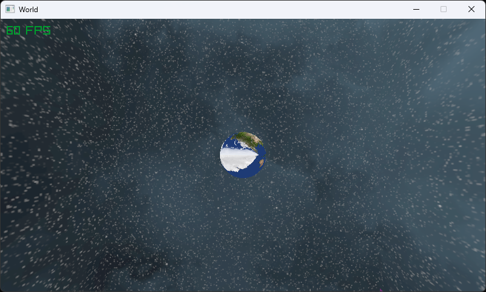

# Spinny World

## What is it?

It's a very simple app I'm working on to learn Raylib and Odin.

## NOTE

I would not use code from this repo in your app because I'm an idiot, and my code is terrible.

Also i know it looks terrible and that's because idk how to do lighting in raylib.

## Showcase

